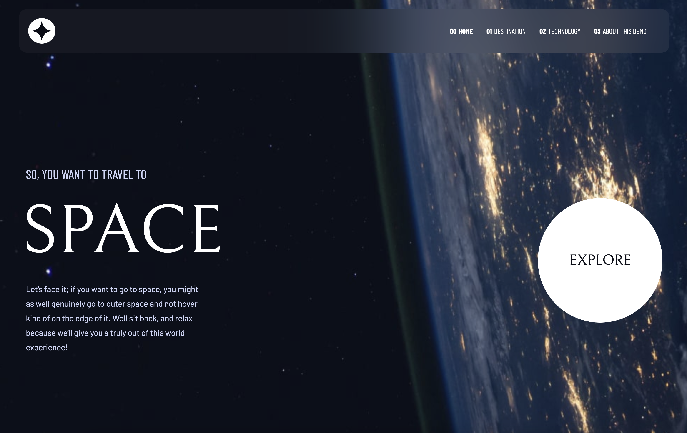
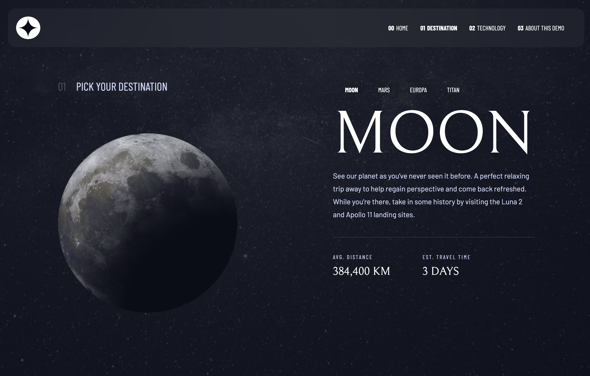
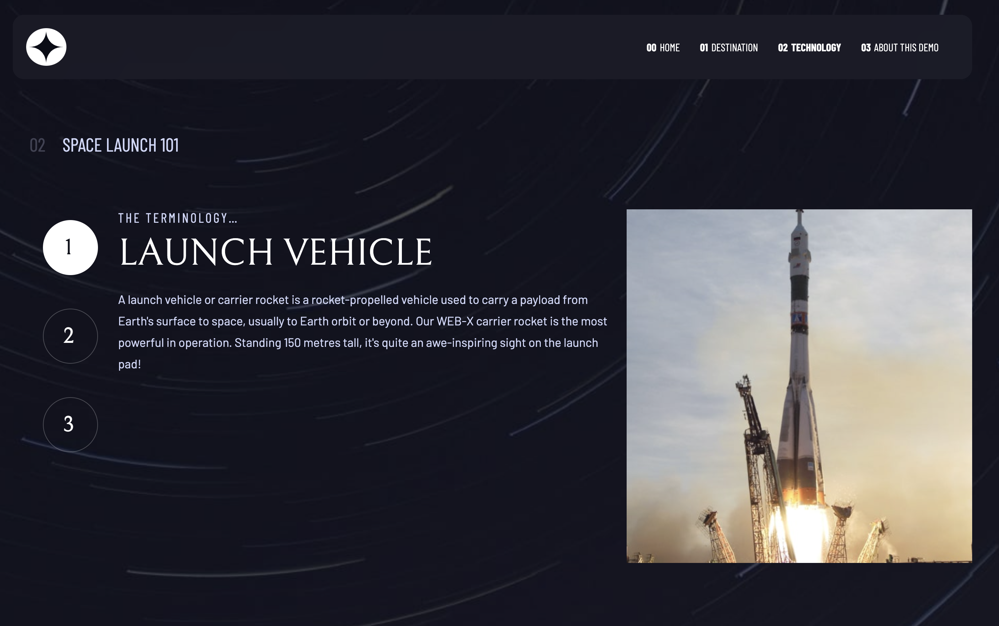

# About this Project

This is a demo website based on a Frontend Mentor challenge:

https://www.frontendmentor.io/challenges/space-tourism-multipage-website-gRWj1URZ3

It is made in React Js and uses the following technologies:
- React Router
- Tailwind CSS
- Vite

## Demo

https://space-demo.vercel.app/

## Screenshots

